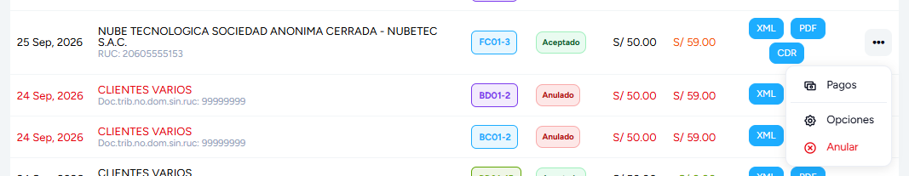
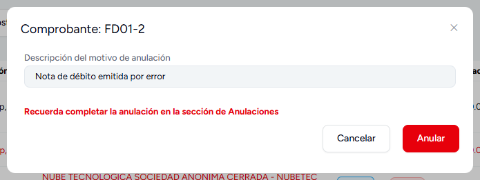
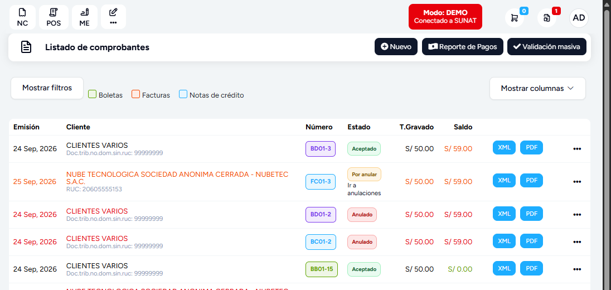
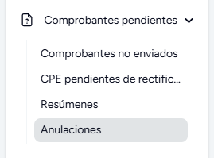
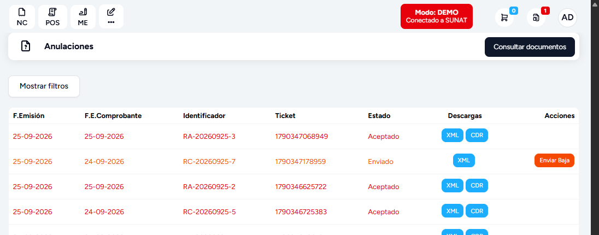
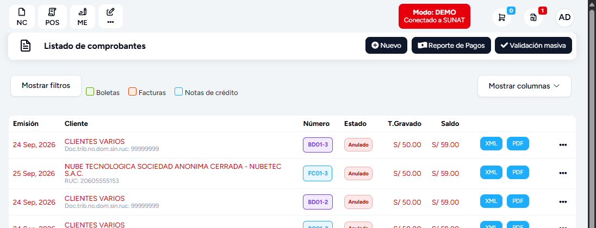

# Anular notas de crédito y débito

Una nota de crédito o de débito aceptada por SUNAT se anula igual que el comprobante al que modifica:

| La nota modifica… | Serie habitual | Se anula con… |
|---|---|---|
| Una factura | `FC01`, `FD01` | Una **comunicación de baja** (`RA-…`) |
| Una boleta | `BC01`, `BD01` | Un **resumen de anulación** (`RC-…`) |

El panel elige el camino solo; tú haces lo mismo en los dos casos. La anulación tiene **dos pasos**: pedirla desde el listado de comprobantes y completarla en **Anulaciones**. Entre uno y otro, la nota queda **Por anular**.

:::info Antes de anular
- Solo se anula una nota **Aceptada**. Si está *Registrada* o *Rechazada*, la opción no aparece.
- El panel da **7 días** desde la emisión de la nota; el plazo se configura ([plazo](#plazo)).
- Cada comprobante se anula por su cuenta: anular la nota no toca la factura o boleta que modifica, y anular esa factura o boleta no anula sus notas.
:::

## 1. Pedir la anulación {#pedir}

Ingresa a **Ventas → Boleta/factura**. Las notas salen en el listado junto a las facturas y boletas, con su serie (`FC01-3`, `BD01-2`…). En la fila de la nota, abre los tres puntos **•••** y selecciona **Anular**.

En una nota el menú es más corto que en una factura: no trae **Nota** ni **Guía**.

Escribe el **motivo de anulación** y selecciona **Anular**.

- En una nota de **factura** el motivo es obligatorio y viaja a SUNAT en la comunicación de baja. Si lo dejas vacío, el campo se marca en rojo: *El campo descripción del motivo de anulación es obligatorio.*
- En una nota de **boleta** el panel no lo exige, y lo que escribas queda solo en el sistema: el resumen no lleva motivo.

Al confirmar, el sistema envía a SUNAT la baja (*La anulación RA-20260925-3 fue creado correctamente*) o el resumen (*El resumen RC-20260925-7 fue creado correctamente*). La nota pasa a **Por anular**, con el enlace **Ir a anulaciones** debajo del estado, y el botón **CDR** desaparece mientras tanto. Si la empresa envía por un PSE o por el OSE SendFact, pasa a **Enviado**, sin el enlace.

:::warning La nota todavía no está anulada
SUNAT responde con un **ticket**, no con la anulación. Mientras nadie consulte ese ticket, la nota sigue **Por anular**.
:::

## 2. Completar la anulación {#completar}

Ingresa a **Comprobantes pendientes → Anulaciones**, o usa el enlace **Ir a anulaciones** de la nota.

Cada anulación es una fila: **RA-…** si la nota era de una factura y **RC-…** si era de una boleta. *F.Emisión* es el día en que pediste la anulación y *F.E.Comprobante*, la fecha de emisión de la nota. Las pendientes están en **Enviado** y tienen el botón **Enviar Baja**.

Selecciona **Enviar Baja**: el sistema consulta el ticket en SUNAT y muestra su respuesta.

- *La Comunicacion de baja RA-…, ha sido aceptada* o *El Resumen diario RC-…, ha sido aceptado*: la fila pasa a **Aceptado**, muestra su **CDR** y la nota queda **Anulada**.
- *El procesamiento del comprobante aún no ha terminado*: SUNAT sigue procesando el ticket. Vuelve a intentarlo en unos minutos.
- Otro texto de SUNAT, con la fila en **Rechazado**: SUNAT rechazó la anulación ([ver abajo](#rechazo)).
- Un error de conexión: la fila no cambia. Vuelve a intentarlo más tarde.

| Quién consulta el ticket | Comunicación de baja (`RA`) | Resumen de anulación (`RC`) |
|---|---|---|
| **Enviar Baja**, en la fila | Sí | Sí |
| **Consultar documentos**, arriba en Anulaciones | Sí, todas las pendientes | No |
| La tarea programada **Consultar las comunicaciones de baja**, si está activa | Sí, de madrugada | No |

Una nota de **boleta** siempre se completa con **Enviar Baja**: si nadie lo pulsa, se queda **Por anular**.

## Qué cambia al anular la nota {#efectos}

- **Estado:** la nota queda **Anulada**. La factura o boleta que modifica no cambia.
- **Stock:** la nota de crédito devolvió al almacén sus productos al emitirse; al anularla se **vuelven a descontar**. La nota de débito los descontó al emitirse; al anularla se **devuelven**. Los dos movimientos quedan en el kardex, a nombre de la nota. La nota de crédito tipo *13* (corrección del monto neto pendiente de pago) no mueve stock ni al emitirse ni al anularse.
- **Documento afectado:** mientras tenga una nota de crédito tipo *Anulación de la operación* aceptada, la factura o boleta no ofrece **Nota** en su menú. Si anulas esa nota, la opción vuelve.
- **Descargas:** la nota conserva su XML y su PDF. La constancia de la anulación es el **CDR** de su fila en *Anulaciones*.

## Plazo {#plazo}

Si la nota se emitió hace más de 7 días, el panel no envía la anulación y responde *El documento excede los 7 días válidos para ser anulado.* El plazo está en **Configuración → Empresa → Avanzado**, pestaña **Contable**: *Restringir envío de comunicación de baja (RA)* y *Días de plazo de envío de la comunicación de baja* ([Avanzado](../../modulos/configuracion-y-mas/configuracion-globales/Empresa/avanzado.md#contable)). Aunque la opción diga «RA», el panel también la aplica a las notas de boleta.

Pasado el plazo, la nota ya no se anula. Lo que se hace es emitir otra nota sobre la misma factura o boleta que compense su efecto; consulta con tu contador cuál corresponde a tu caso.

## Si SUNAT rechaza la anulación {#rechazo}

Solo *ha sido aceptada* (o *aceptado*) completa la anulación. Si la fila queda en **Rechazado**, SUNAT no anuló la nota y, para SUNAT, sigue aceptada. Pero en el sistema no se queda igual:

- **Nota de factura:** la nota aparece **Anulada** igualmente, y su stock se movió como si lo estuviera.
- **Nota de boleta:** la nota vuelve a **Registrado**. Así, el siguiente resumen diario de esa fecha la declararía otra vez.

Eso pasa si la empresa envía directo a SUNAT o por un OSE. Si envía por un PSE o por el OSE SendFact, la fila y la nota se quedan en **Enviado**.

En los dos casos el menú de la nota ya no ofrece **Anular**, que solo aparece en una nota **Aceptada**. Primero devuelve la nota a su estado real: en **Reportes → Validador de documentos**, busca la nota y selecciona **Regularizar documentos**, que toma el estado de SUNAT y la deja **Aceptada** ([Validador de documentos](../../modulos/Complementarios/reportes/General/validador-de-documentos.md)). Después corrige lo que diga el rechazo y, si sigue dentro del plazo, anúlala otra vez.

Si era una nota de factura, el validador no revierte el stock que movió la anulación rechazada: ajústalo con un movimiento de inventario.

## Por API

Las integraciones anulan igual, con los mismos dos pasos: la nota de una factura por `POST /api/voided` y la de una boleta por `POST /api/summaries` con `"3"`. Los cuerpos, las respuestas y los errores están en [Anular una nota de crédito o de débito](../../devs/api/offline/endpoints/41-anular-notas-de-credito-y-debito.md).

Ver también [Emitir notas de crédito y débito](emitir-notas-de-credito-y-debito.md) y [Anulación de comprobantes](anular-comprobantes.md).
