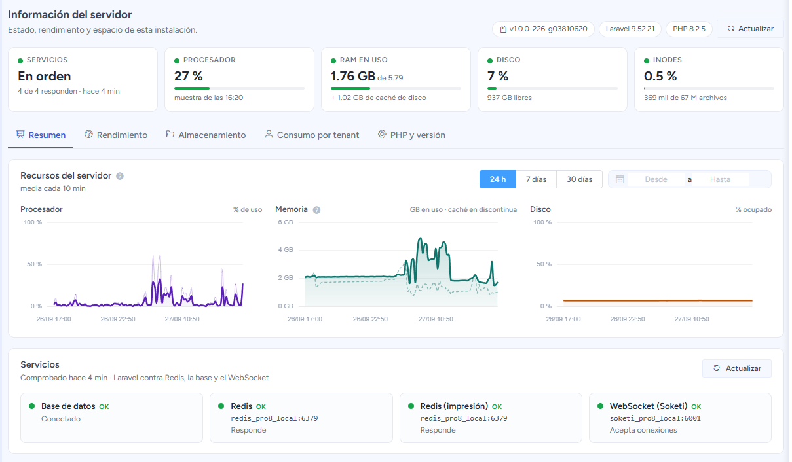
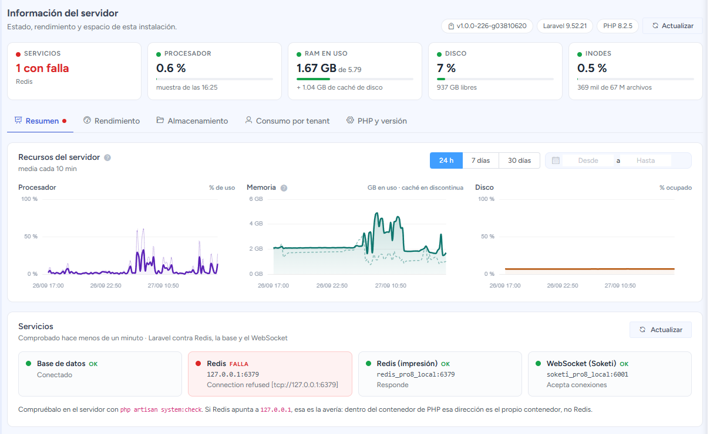
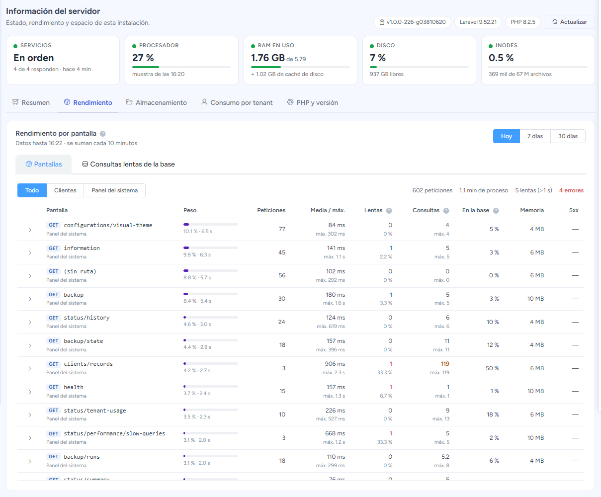
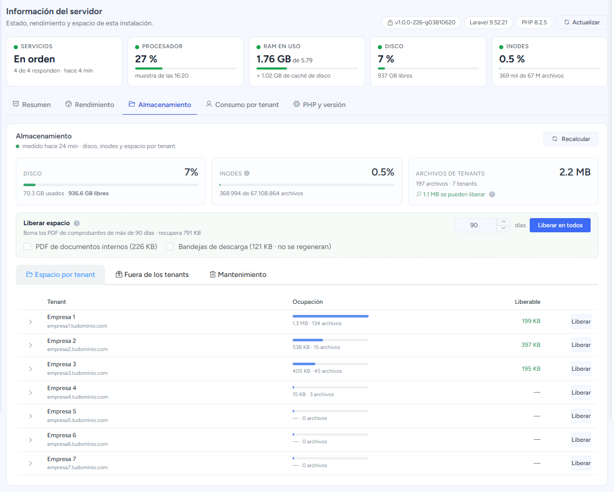
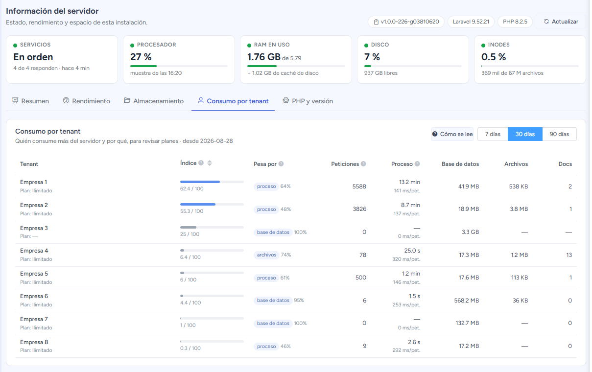
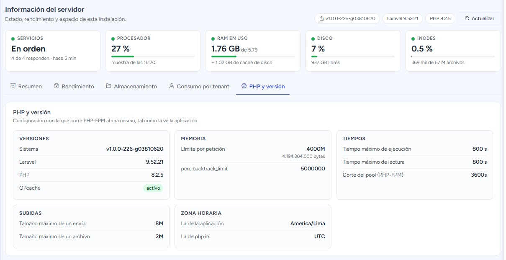

# Información

El módulo **Información** del panel **Administrador** muestra el estado del servidor: si todo
responde, cuánto se usa de procesador, memoria y disco, qué pantallas consumen más y cuánto
consume cada cliente. Sirve para detectar un problema antes de que lo noten los clientes y para
decidir qué mejorar.

La página tiene tres partes, de arriba abajo:

1. **Cabecera:** la versión del sistema, de Laravel y de PHP. El botón **Actualizar** vuelve a leer
   el estado sin recargar la página.
2. **Franja de estado:** cinco cifras que se ven siempre, estés en la sección que estés.
3. **Secciones:** Resumen, Rendimiento, Almacenamiento, Consumo por tenant, y PHP y versión.

:::tip Enlaza una sección directamente
La sección abierta queda en la dirección de la página, por ejemplo
`…/information#rendimiento`. Puedes guardarla en favoritos o compartirla, y al recargar se abre en
la misma sección.
:::

## La franja de estado

| Cifra | Qué dice |
|---|---|
| **Servicios** | Si la aplicación llega a la base de datos, a Redis y al servidor de avisos en tiempo real (WebSocket). Dice «En orden» o cuántos fallan y cuáles. |
| **Procesador** | Uso del procesador en la última muestra (se toma una cada 5 minutos). |
| **RAM en uso** | Memoria ocupada de la total. La caché de disco va aparte, porque el sistema la libera en cuanto alguien pide memoria. |
| **Disco** | Porcentaje ocupado y espacio libre. |
| **Inodes** | Cuántos archivos caben todavía. Se agotan antes que el disco cuando hay muchos archivos pequeños, y entonces el servidor deja de poder crear archivos aunque queden gigabytes libres. |

Cada cifra tiene un punto de color:
- **Verde:** todo bien.
- **Ámbar:** conviene mirarlo (procesador desde el 70 %; RAM, disco e inodes desde el 80 %).
- **Rojo:** hay que actuar (desde el 90 %, o un servicio caído).

Al hacer clic en una cifra se abre la sección donde está el detalle.

La franja **no mide nada al abrir la página**: muestra lo último que registraron las tareas
automáticas del servidor. Por eso carga al instante y no le añade trabajo al servidor.

### Cuando algo falla

Si un servicio no responde, su cifra se pone en rojo, la sección **Resumen** lleva un punto rojo
y la tarjeta del servicio dice el motivo y a qué dirección intentó conectarse:

En el ejemplo, Redis apunta a `127.0.0.1`. Esa es la avería típica: dentro del contenedor de PHP,
esa dirección es el propio contenedor, no Redis. Se corrige en la configuración del servidor
(`REDIS_HOST` debe ser el nombre del contenedor de Redis). El detalle técnico está en
[Servicios operativos](/devs/operacion/servicios-operativos).

## Resumen

Los gráficos de **procesador, memoria y disco**, lado a lado, y debajo el estado de cada
**servicio**.

- **Rango:** usa los botones **24 h · 7 días · 30 días**, o elige fechas con el calendario.
- **Agrupación:** en rangos largos se muestra la media por hora o por día, para que el gráfico
  se pueda leer.
- **Picos:** en el procesador, la línea tenue es el pico de cada tramo, para que no se pierda
  aunque la media sea baja.
- **Memoria:** la línea discontinua es la caché de disco.

:::note Por qué el disco importa más que los otros dos
El procesador y la memoria se recuperan solos: suben y al rato bajan. El disco no — solo crece,
y cuando se llena el sistema deja de poder emitir. Es la única de las tres cuya **tendencia**
hay que mirar.
:::

El histórico se conserva **90 días**.

## Rendimiento

Qué pantallas consumen el servidor. Sirve para decidir **qué mejorar primero**.

Cada fila es una pantalla o acción del sistema, por ejemplo `clients/records`, que es el listado
de clientes del panel. Las columnas:

| Columna | Qué significa |
|---|---|
| **Peso** | Qué parte del tiempo total del servidor se llevó esa pantalla. **Es la columna para decidir.** |
| **Peticiones** | Cuántas veces se abrió. |
| **Media / máx.** | Cuánto tardó en promedio y la vez que más tardó. |
| **Lentas** | Cuántas veces pasó de 1 segundo, y qué porcentaje son. En rojo si pasan del 5 %. |
| **Consultas** | Cuántas consultas a la base de datos hace cada apertura. En ámbar si pasan de 100. |
| **En la base** | Qué parte del tiempo se fue esperando a la base de datos. |
| **Memoria** | La memoria más alta que usó. |
| **5xx** | Cuántas veces terminó en error del servidor. |

Arriba puedes elegir el rango (**Hoy · 7 días · 30 días**) y filtrar entre **Todo**, las pantallas
de los **Clientes** y las del **Panel del sistema**. Al hacer clic en la flecha de una fila se ve
a qué clientes les pesa esa pantalla.

:::tip Cómo leerla
- **Prioriza por Peso, no por el máximo.** Una pantalla de 300 ms abierta 20 000 veces cuesta más
  que un informe de 30 segundos que se abre una vez al mes.
- **Muchas consultas por apertura** (más de 100) suele indicar que la pantalla consulta fila por
  fila. Es un arreglo de programación, no de más servidor. En la captura, el listado de clientes
  hace 119 por apertura y crece con cada cliente nuevo.
- **Mucho tiempo en la base:** faltan índices o la consulta es pesada.
- **Poco tiempo en la base y aun así lenta:** el tiempo se va en el propio sistema (por ejemplo,
  PDF o servicios externos).
:::

- **Qué se guarda:** solo el nombre de la pantalla, nunca la dirección completa, los datos que se
  enviaron ni la IP.
- **Cada cuánto se actualiza:** las cifras se suman cada 10 minutos. Arriba de la tabla dice
  hasta qué hora hay datos.

La pestaña **Consultas lentas de la base** lista las consultas que tardaron más de 2 segundos,
agrupadas y con cada dato reemplazado por `?`. Solo la ve el **administrador principal**.

## Almacenamiento

**Cuánto ocupa el sistema y quién lo ocupa.**

- **Disco e inodes**, con el espacio usado y libre.
- **Espacio por tenant:** lo que ocupa cada cliente, de mayor a menor. Al desplegar una fila se ve
  el detalle por carpeta, con la marca de cuál se regenera sola y cuál está protegida.
- **Fuera de los tenants:** respaldos previos a cada actualización, registros y cachés. Suele ser
  lo que más pesa y lo que nadie mira.
- **Mantenimiento:** tablas internas de diagnóstico que crecen solas, con botones para podarlas
  o vaciarlas.

Las cifras se calculan **cada hora**, no al abrir la página. Verás cuándo se midieron, y puedes
forzar un recálculo con **Recalcular**.

### Liberar espacio

Puedes liberar espacio de todos los clientes (**Liberar en todos**) o de uno (**Liberar** en su
fila). Funciona en dos pasos: primero calcula cuánto se liberaría y solo entonces pide
confirmación.

- **Lo que se borra:** los PDF, que se vuelven a generar cuando alguien los pide, así que
  borrarlos no pierde nada.
- **Lo que no se toca nunca:** los XML firmados, los CDR, los certificados y los adjuntos, porque
  no se pueden regenerar.
- **Opcional:** puedes incluir los PDF de documentos internos (notas de venta, pedidos,
  cotizaciones) y las **bandejas de descarga**. Las bandejas **no** se regeneran: al borrarlas
  desaparece su botón de descarga del historial.

Por defecto solo se borra lo de más de 90 días.

## Consumo por tenant

Responde a «¿qué plan le corresponde a este cliente?» con datos en vez de intuición.

| Columna | Qué significa |
|---|---|
| **Índice** | Posición del cliente de 0 a 100, comparado con el que más consume de esta instalación. |
| **Pesa por** | Qué explica ese consumo: proceso, tráfico, base de datos o archivos. |
| **Peticiones** y **Proceso** | Cuánto usa el sistema y cuánto tiempo de servidor suma. |
| **Base de datos**, **Archivos** y **Docs** | Tamaño de su base, de sus archivos y comprobantes emitidos. |

:::note Qué se mide y qué no
Todos los clientes comparten los mismos procesos y la misma base de datos, así que la memoria y
el procesador **no se pueden medir por cliente**. Lo que se hace es **atribuir**: medir cada
petición y sumarla al cliente que la provocó.
:::

La columna **«Pesa por»** orienta la conversación: no es lo mismo un cliente que consume por
*tráfico* (muchos usuarios trabajando) que uno que solo *acumula datos*. El botón **Cómo se lee**
abre una explicación de cada columna.

## PHP y versión

La configuración con la que corre el sistema, agrupada por tema.

- **Versiones:** del sistema, Laravel y PHP, y si **OPcache** está activo. Sin OPcache, cada
  pantalla tarda varias veces más; si dice otra cosa que «activo», avisa a soporte.
- **Memoria:** el límite de memoria por petición.
- **Tiempos:** cuánto puede tardar una petición antes de cortarse.
- **Subidas:** tamaño máximo de un envío y de un archivo.
- **Zona horaria:** la de la aplicación y la de PHP. La que importa es la de la aplicación.

## En el celular

La página se adapta a pantallas pequeñas:
- la franja de estado se ordena en dos columnas;
- las secciones se muestran como botones;
- las tablas se desplazan de lado dentro de su tarjeta.

